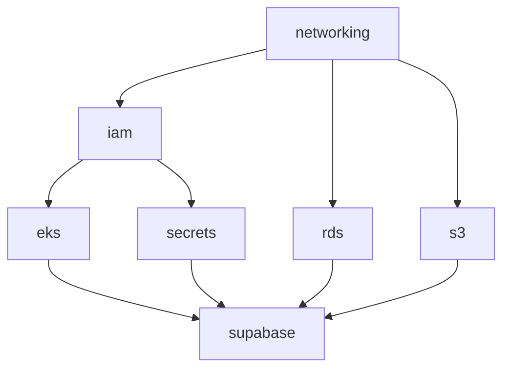

# Supabase on AWS - Infrastructure Implementation Plan

## 🎯 Project Overview

This project implements a production-ready, secure, and scalable deployment of [Supabase](https://supabase.com/) on AWS using Infrastructure as Code (Terraform), managed Kubernetes (EKS), and cloud-native services. The solution demonstrates enterprise-grade practices for container orchestration, security, and automated deployment.

### 🏗️ Architecture Goals

- **Security First**: Private networking, secrets management, least privilege IAM
- **High Availability**: Multi-AZ deployment across eu-west-1 region
- **Scalability**: Auto-scaling at both infrastructure and application layers
- **Maintainability**: Modular, reusable Terraform code following proven patterns
- **Observability**: Built-in monitoring and logging capabilities

### Architecture Diagram
- **Architecture Diagram**: [Architecture Diagram](https://drive.google.com/file/d/1R1-EXfipFFybK2vmXCDeMppdKgj7mGSS/view?usp=sharing)


## 📋 Requirements Analysis

Based on the project requirements, this solution addresses:

✅ **Infrastructure as Code**: Terraform with modular design  
✅ **Managed Kubernetes**: Amazon EKS with private networking  
✅ **Managed Database**: Amazon RDS PostgreSQL with Multi-AZ  
✅ **Object Storage**: Amazon S3 with encryption  
✅ **Secrets Management**: AWS Secrets Manager + External Secrets Operator  
✅ **Security**: Network isolation, IAM least privilege, encryption at rest/transit  
✅ **Autoscaling**: HPA for pods, Cluster Autoscaler for nodes  
✅ **Observability**: CloudWatch integration, metrics collection ready  

## 🏛️ High-Level Architecture

```
┌─────────────────────────────────────────────────────────────┐
│                        AWS Account                           │
│  ┌─────────────────────────────────────────────────────────┐ │
│  │                    VPC (eu-west-1)                      │ │
│  │  ┌─────────────┐  ┌─────────────┐  ┌─────────────┐    │ │
│  │  │     AZ-a    │  │     AZ-b    │  │     AZ-c    │    │ │
│  │  │             │  │             │  │             │    │ │
│  │  │ ┌─────────┐ │  │ ┌─────────┐ │  │ ┌─────────┐ │    │ │
│  │  │ │ Public  │ │  │ │ Public  │ │  │ │ Public  │ │    │ │
│  │  │ │ Subnet  │ │  │ │ Subnet  │ │  │ │ Subnet  │ │    │ │
│  │  │ └─────────┘ │  │ └─────────┘ │  │ └─────────┘ │    │ │
│  │  │ ┌─────────┐ │  │ ┌─────────┐ │  │ ┌─────────┐ │    │ │
│  │  │ │   EKS   │ │  │ │   EKS   │ │  │ │   EKS   │ │    │ │
│  │  │ │ Private │ │  │ │ Private │ │  │ │ Private │ │    │ │
│  │  │ │ Subnet  │ │  │ │ Subnet  │ │  │ │ Subnet  │ │    │ │
│  │  │ └─────────┘ │  │ └─────────┘ │  │ └─────────┘ │    │ │
│  │  │ ┌─────────┐ │  │ ┌─────────┐ │  │ ┌─────────┐ │    │ │
│  │  │ │   RDS   │ │  │ │   RDS   │ │  │ │   RDS   │ │    │ │
│  │  │ │ Private │ │  │ │ Private │ │  │ │ Private │ │    │ │
│  │  │ │ Subnet  │ │  │ │ Subnet  │ │  │ │ Subnet  │ │    │ │
│  │  │ └─────────┘ │  │ └─────────┘ │  │ └─────────┘ │    │ │
│  │  └─────────────┘  └─────────────┘  └─────────────┘    │ │
│  └─────────────────────────────────────────────────────────┘ │
│                                                             │
│  ┌─────────────────────┐  ┌─────────────────────┐           │
│  │    AWS Services     │  │   External Access   │           │
│  │ ┌─────────────────┐ │  │ ┌─────────────────┐ │           │
│  │ │ Secrets Manager │ │  │ │ Application     │ │           │
│  │ │                 │ │  │ │ Load Balancer   │ │           │
│  │ └─────────────────┘ │  │ └─────────────────┘ │           │
│  │ ┌─────────────────┐ │  │ ┌─────────────────┐ │           │
│  │ │   S3 Bucket     │ │  │ │  Route53 DNS    │ │           │
│  │ │                 │ │  │ │   (Optional)    │ │           │
│  │ └─────────────────┘ │  │ └─────────────────┘ │           │
│  └─────────────────────┘  └─────────────────────┘           │
└─────────────────────────────────────────────────────────────┘
```

## 📁 Detailed Module Breakdown

### 1. `modules/networking`
**Purpose**: Secure, isolated network foundation with proper segmentation

**Components**:
- VPC with DNS support enabled
- Internet Gateway for public internet access
- NAT Gateway for outbound private subnet traffic
- Multi-AZ subnets:
  - **Public Subnets**: ALB, NAT Gateway
  - **EKS Private Subnets**: Kubernetes worker nodes
  - **RDS Private Subnets**: Database instances
- Route tables with appropriate routing
- Security groups with minimal required access

**Key Features**:
- CIDR block: `10.100.0.0/16` (configurable)
- 3 Availability Zones support
- Network ACLs for additional security layer
- VPC Flow Logs for network monitoring

**Inputs**:
```hcl
vpc_cidr = "10.100.0.0/16"
public_subnet_cidrs = ["10.100.1.0/24", "10.100.2.0/24", "10.100.3.0/24"]
eks_subnet_cidrs = ["10.100.10.0/24", "10.100.11.0/24", "10.100.12.0/24"]
rds_subnet_cidrs = ["10.100.20.0/24", "10.100.21.0/24", "10.100.22.0/24"]
```

**Outputs**: VPC ID, subnet IDs, security group IDs, route table IDs

### 2. `modules/iam`
**Purpose**: Centralized IAM management with least privilege principle

**Components**:
- EKS cluster service role
- EKS node group roles
- External Secrets Operator role
- AWS Load Balancer Controller role
- Cluster Autoscaler role
- RDS enhanced monitoring role

**Key Features**:
- OIDC provider integration for IRSA (IAM Roles for Service Accounts)
- Custom policies for specific AWS service access
- Cross-account assume role support
- Policy templates with environment-specific parameters

**Security Policies**:
```json
{
  "eks_cluster_policy": "AmazonEKSClusterPolicy",
  "eks_worker_policies": [
    "AmazonEKSWorkerNodePolicy",
    "AmazonEKS_CNI_Policy", 
    "AmazonEC2ContainerRegistryReadOnly"
  ],
  "custom_policies": [
    "secrets_manager_access",
    "s3_supabase_access",
    "rds_connect_access"
  ]
}
```

### 3. `modules/eks`
**Purpose**: Managed Kubernetes cluster with enterprise features

**Components**:
- EKS cluster in private subnets
- Managed node groups with auto-scaling
- Essential add-ons (VPC CNI, CoreDNS, kube-proxy)
- EBS CSI driver for persistent storage
- OIDC provider for service account authentication

**Key Features**:
- Kubernetes version: 1.30+ (configurable)
- Private API server endpoint
- Envelope encryption with KMS
- Multiple node groups (on-demand + spot instances)
- Launch templates with security hardening
- CloudWatch logging enabled

**Node Group Configuration**:
```hcl
node_groups = [
  {
    name = "supabase-general"
    instance_types = ["t3.large", "t3.xlarge"]
    capacity_type = "ON_DEMAND"
    scaling_config = {
      desired_size = 3
      max_size = 10
      min_size = 1
    }
  },
  {
    name = "supabase-spot"
    instance_types = ["t3.large", "m5.large", "m5a.large"]
    capacity_type = "SPOT"
    scaling_config = {
      desired_size = 2
      max_size = 20
      min_size = 0
    }
  }
]
```

### 4. `modules/rds`
**Purpose**: Highly available PostgreSQL database for Supabase

**Components**:
- RDS PostgreSQL instance (Multi-AZ)
- DB subnet group spanning multiple AZs
- DB parameter group with optimized settings
- Security group with controlled access
- Enhanced monitoring and Performance Insights

**Key Features**:
- PostgreSQL 15+ (latest stable)
- Multi-AZ deployment for high availability
- Automated backups with point-in-time recovery
- Encryption at rest with KMS
- Connection pooling configuration
- Database extensions required by Supabase

**Database Configuration**:
```hcl
instance_class = "db.t3.medium"  # Configurable based on workload
allocated_storage = 100          # Initial size with auto-scaling
storage_encrypted = true
multi_az = true
backup_retention_period = 7
backup_window = "03:00-04:00"
maintenance_window = "sun:04:00-sun:05:00"
```

**Required Extensions**:
- `uuid-ossp`: UUID generation
- `pgcrypto`: Cryptographic functions
- `pgjwt`: JWT token handling
- `postgis`: Geospatial data (if needed)

### 5. `modules/s3`
**Purpose**: Object storage for Supabase files and backups

**Components**:
- S3 bucket with versioning enabled
- Bucket policy for Supabase access
- Lifecycle rules for cost optimization
- Server-side encryption (SSE-S3 or SSE-KMS)
- CORS configuration for web access

**Key Features**:
- Versioning enabled for data protection
- Public read blocked by default
- Encryption at rest
- Access logging enabled
- Lifecycle policies for old version cleanup

**Security Configuration**:
```hcl
bucket_policy = {
  effect = "Allow"
  principals = ["arn:aws:iam::ACCOUNT:role/supabase-storage-role"]
  actions = ["s3:GetObject", "s3:PutObject", "s3:DeleteObject"]
  resources = ["arn:aws:s3:::supabase-storage/*"]
}
```

### 6. `modules/secrets`
**Purpose**: Centralized secrets management for Supabase configuration

**Components**:
- AWS Secrets Manager secrets
- KMS key for encryption
- IAM policies for secret access
- Secret rotation configuration (where applicable)

**Secrets Managed**:
- `supabase/jwt-secret`: JWT signing secret
- `supabase/anon-key`: Anonymous API key
- `supabase/service-role-key`: Service role API key
- `supabase/database-url`: PostgreSQL connection string
- `supabase/smtp-config`: Email service configuration

**Secret Structure**:
```json
{
  "supabase/config": {
    "jwt_secret": "random-256-bit-key",
    "anon_key": "generated-api-key",
    "service_role_key": "generated-service-key",
    "smtp_user": "ses-smtp-user",
    "smtp_password": "ses-smtp-password"
  }
}
```

### 7. `modules/supabase`
**Purpose**: Kubernetes deployment of Supabase stack

**Components**:
- Helm chart deployment with custom values
- Kubernetes namespaces and RBAC
- Service accounts with IRSA annotations
- ConfigMaps for non-sensitive configuration
- Services and ingress definitions

**Supabase Components Deployed**:
- **Kong Gateway**: API gateway and authentication
- **PostgREST**: Automatic REST API from PostgreSQL
- **Realtime**: WebSocket connections for live updates
- **Storage**: File upload and management
- **Auth**: User authentication and authorization
- **Dashboard**: Administrative interface

**Helm Values Structure**:
```yaml
supabase:
  database:
    external: true
    host: "rds-endpoint-from-terraform"
  
  storage:
    backend: "s3"
    s3:
      bucket: "bucket-name-from-terraform"
      region: "eu-west-1"
  
  auth:
    external_url: "https://api.supabase.yourdomain.com"
    jwt_secret: 
      valueFrom:
        secretKeyRef:
          name: supabase-secrets
          key: jwt-secret
```

## 🎯 Modular Approach Benefits

### 1. **Separation of Concerns**
Each module handles a specific infrastructure domain:
- Networking module focuses solely on VPC and connectivity
- EKS module manages Kubernetes infrastructure
- RDS module handles database provisioning
- Security modules manage IAM and secrets

### 2. **Reusability**
Modules can be reused across:
- Multiple environments (dev, staging, prod)
- Different regions
- Various projects with similar requirements

### 3. **Environment Isolation**
```
environments/
├── ireland/development/    # Dev environment in eu-west-1
├── ireland/staging/        # Staging environment
├── ireland/production/     # Production environment
└── frankfurt/production/   # DR site in eu-central-1
```

### 4. **State Management**
Separate Terraform state files for each layer:
- `networking.tfstate`: VPC, subnets, routing
- `core.tfstate`: EKS, RDS, S3, Secrets Manager
- `applications.tfstate`: Supabase deployment

This approach enables:
- Independent deployment cycles
- Reduced blast radius for changes
- Team specialization (network team vs app team)

## 🔧 Implementation Strategy

### Phase 1: Foundation Infrastructure (Week 1)

#### Day 1-2: Network Foundation
- **Target**: Secure, isolated networking layer
- **Deliverables**:
  - VPC with proper CIDR allocation
  - Multi-AZ subnet architecture
  - NAT Gateway for private subnet internet access
  - Security groups with minimal required access
  - Network ACLs for additional security

#### Day 2-3: Identity and Access Management
- **Target**: Least privilege IAM setup
- **Deliverables**:
  - EKS cluster and node group service roles
  - OIDC provider for IRSA
  - Custom policies for AWS service integration
  - Service account roles for Kubernetes workloads

### Phase 2: Managed Services (Week 1-2)

#### Day 3-4: Kubernetes Infrastructure
- **Target**: Production-ready EKS cluster
- **Deliverables**:
  - EKS cluster in private subnets
  - Managed node groups with auto-scaling
  - Essential add-ons and CSI drivers
  - Cluster autoscaler deployment
  - Network policies for pod isolation

#### Day 4-5: Database Infrastructure
- **Target**: Highly available PostgreSQL
- **Deliverables**:
  - Multi-AZ RDS PostgreSQL instance
  - Subnet groups and security groups
  - Parameter groups with Supabase optimizations
  - Backup configuration and monitoring
  - Database extensions setup

### Phase 3: Application Services (Week 2)

#### Day 5-6: Storage and Secrets
- **Target**: Secure storage and configuration
- **Deliverables**:
  - S3 bucket with proper access policies
  - Secrets Manager setup with rotation
  - External Secrets Operator deployment
  - KMS keys for encryption

#### Day 6-7: Supabase Deployment
- **Target**: Fully functional Supabase instance
- **Deliverables**:
  - Custom Helm chart with AWS integration
  - Ingress controller for external access
  - HPA for component auto-scaling
  - Health checks and readiness probes

## 📊 Terraform Module Dependencies



### Dependency Explanation:
1. **Networking** provides VPC and subnet IDs required by all other modules
2. **IAM** creates roles needed by EKS and application workloads
3. **EKS** requires both networking and IAM to be established
4. **RDS** needs networking for subnet groups and security
5. **Supabase** depends on all infrastructure components being ready

## 🔒 Security Implementation

### Network Security
```hcl
# EKS cluster security group
resource "aws_security_group" "eks_cluster" {
  name_prefix = "eks-cluster-"
  vpc_id      = var.vpc_id

  # Only allow HTTPS from ALB
  ingress {
    from_port       = 443
    to_port         = 443
    protocol        = "tcp"
    security_groups = [aws_security_group.alb.id]
  }

  # Allow all outbound traffic
  egress {
    from_port   = 0
    to_port     = 0
    protocol    = "-1"
    cidr_blocks = ["0.0.0.0/0"]
  }
}

# RDS security group
resource "aws_security_group" "rds" {
  name_prefix = "rds-postgresql-"
  vpc_id      = var.vpc_id

  # Only allow PostgreSQL from EKS nodes
  ingress {
    from_port       = 5432
    to_port         = 5432
    protocol        = "tcp"
    security_groups = [aws_security_group.eks_nodes.id]
  }
}
```

### Secrets Management Pattern
```yaml
apiVersion: external-secrets.io/v1beta1
kind: SecretStore
metadata:
  name: aws-secrets-manager
spec:
  provider:
    aws:
      service: SecretsManager
      region: eu-west-1
      auth:
        serviceAccount:
          name: external-secrets-sa
---
apiVersion: external-secrets.io/v1beta1
kind: ExternalSecret
metadata:
  name: supabase-config
spec:
  secretStoreRef:
    name: aws-secrets-manager
    kind: SecretStore
  target:
    name: supabase-secrets
  data:
  - secretKey: jwt-secret
    remoteRef:
      key: supabase/config
      property: jwt_secret
```

## 🚀 Deployment Workflow

### Prerequisites Setup
```bash
# Install required tools
terraform --version  # >= 1.12
aws --version        # >= 2.0
kubectl --version    # >= 1.28
helm --version       # >= 3.12

# Configure AWS credentials
aws configure
aws sts get-caller-identity
```

### Infrastructure Deployment
```bash
# 1. Deploy networking layer
cd environments/ireland/development/networking
terraform init
terraform plan -out=networking.tfplan
terraform apply networking.tfplan

# 2. Deploy core infrastructure
cd ../core
terraform init
terraform plan -out=core.tfplan
terraform apply core.tfplan

# 3. Configure kubectl context
aws eks update-kubeconfig --name supabase-dev-eks --region eu-west-1

# 4. Deploy applications
cd ../applications
terraform init
terraform plan -out=apps.tfplan
terraform apply apps.tfplan
```

### Verification Commands
```bash
# Check EKS cluster status
kubectl get nodes
kubectl get pods -A

# Verify Supabase services
kubectl get pods -n supabase
kubectl get svc -n supabase
kubectl get ingress -n supabase

# Test Supabase API
curl -H "apikey: YOUR_ANON_KEY" \
  https://your-supabase-endpoint/rest/v1/health
```

## 📈 Scaling and Performance

### Auto-scaling Configuration

#### Cluster Level
```hcl
# Cluster Autoscaler for node scaling
resource "helm_release" "cluster_autoscaler" {
  name       = "cluster-autoscaler"
  repository = "https://kubernetes.github.io/autoscaler"
  chart      = "cluster-autoscaler"
  
  set {
    name  = "autoDiscovery.clusterName"
    value = var.cluster_name
  }
}
```

#### Application Level
```yaml
# HPA for PostgREST
apiVersion: autoscaling/v2
kind: HorizontalPodAutoscaler
metadata:
  name: postgrest-hpa
spec:
  scaleTargetRef:
    apiVersion: apps/v1
    kind: Deployment
    name: supabase-postgrest
  minReplicas: 2
  maxReplicas: 10
  metrics:
  - type: Resource
    resource:
      name: cpu
      target:
        type: Utilization
        averageUtilization: 70
```

### Performance Optimizations
- **Database**: Connection pooling with PgBouncer
- **Storage**: S3 Transfer Acceleration for global access
- **Caching**: Redis for session and query caching
- **CDN**: CloudFront for static asset delivery

## 🔍 Observability and Monitoring

### CloudWatch Integration
```hcl
# EKS cluster logging
resource "aws_eks_cluster" "main" {
  enabled_cluster_log_types = [
    "api",
    "audit", 
    "authenticator",
    "controllerManager",
    "scheduler"
  ]
}
```

## 🛡️ Security Deep Dive

### Network Security Layers
1. **VPC Level**: Private subnets, NACLs, flow logs
2. **Security Groups**: Application-specific rules
3. **Kubernetes**: Network policies, pod security standards
4. **Application**: TLS termination, authentication middleware

### Secrets and Configuration
```hcl
# Secret creation with rotation
resource "aws_secretsmanager_secret" "supabase_config" {
  name         = "supabase/config"
  description  = "Supabase configuration secrets"
  
  replica {
    region = "eu-central-1"  # Cross-region replication
  }
}

# Automatic rotation for database credentials
resource "aws_secretsmanager_secret_rotation" "rds_rotation" {
  secret_id           = aws_secretsmanager_secret.rds_credentials.id
  rotation_lambda_arn = aws_lambda_function.rds_rotation.arn
  
  rotation_rules {
    automatically_after_days = 30
  }
}
```

### Testing Strategy
1. **Infrastructure Tests**: Terraform plan validation
2. **Security Tests**: `checkov` or `tfsec` scans
3. **Integration Tests**: Kubernetes resource validation
4. **Smoke Tests**: API endpoint health checks

### Code Quality
- Terraform formatting: `terraform fmt`
- Linting: `tflint` with custom rules
- Security scanning: `tfsec` for Terraform security
- Documentation: Auto-generated with `terraform-docs`

## 🎛️ Configuration Management

### Environment Variables
```hcl
# environments/ireland/development/terraform.tfvars
region = "eu-west-1"
environment = "development"
cluster_name = "supabase-dev"

# Network configuration
vpc_cidr = "10.100.0.0/16"
availability_zones = ["eu-west-1a", "eu-west-1b", "eu-west-1c"]

# EKS configuration
kubernetes_version = "1.30"
node_instance_types = ["t3.large", "t3.xlarge"]

# Database configuration
db_instance_class = "db.t3.medium"
db_allocated_storage = 100

# Application configuration
supabase_version = "latest"
enable_auth = true
enable_storage = true
enable_realtime = true
```

---

This implementation plan provides a roadmap for creating a production-ready, secure, and scalable Supabase deployment on AWS, leveraging proven patterns from existing infrastructure while addressing specific requirements for modern cloud-native applications.